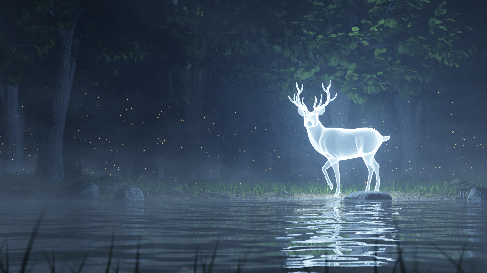
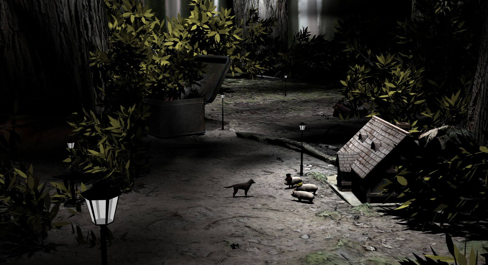

## CS148: Introduction to Computer Graphics and Imaging

This is the introductory prerequisite course in the computer graphics sequence which introduces students to the technical concepts behind creating synthetic computer generated images. The beginning of the course focuses on using Blender to create visual imagery, as well as an understanding of the underlying mathematical concepts including triangles, normals, interpolation, texture mapping, bump mapping, etc. Then we move on to a more fundamental understanding of light and color, as well as how it impacts computer displays and printers. From this we discuss more thoroughly how light interacts with the environment, and we construct engineering models such as the BRDF and discuss various simplifications into more basic lighting and shading models. Finally, we discuss ray tracing technology for creating virtual images, while drawing parallels between ray tracers and real world cameras in order to illustrate various concepts. Anti-aliasing and acceleration structures are also discussed. The final class project consists of building out a ray tracer to create a visually compelling image. Starter codes and code bits will be provided here and there to aid in development, but this class focuses on what you can do with the code as opposed to what the code itself looks like. Therefore grading is weighted towards in person "demos" of the code in action - creativity and the production of impressive visual imagery are highly encouraged.

## Sampled Student Work

